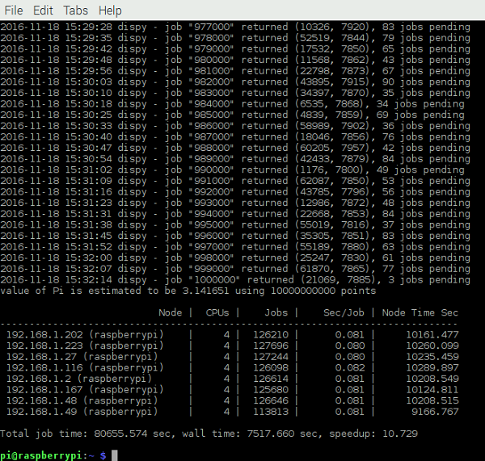

## Using the completed OctaPi for the first time

- Ensure that the dedicated WiFi router, client, and OctaPi servers are all powered up. It's best to power up the WiFi router well in advance so that you can be sure it is fully booted before the OctaPi client and servers attempt to log into it.

- On the client machine, open a terminal.

    

- Try running the `compute.py` example software again by typing the following command:

    ```bash
    sudo python3 compute.py
    ```

    If the OctaPi is working correctly, at the end of the run all the servers used to execute the job will be listed in the table. The result should look similar to this.

    ```bash

                               Node |  CPUs |    Jobs |    Sec/Job | Node Time Sec
    ------------------------------------------------------------------------------
     192.168.1.49 (raspberrypi)     |     4 |       4 |     16.040 |        64.160
     192.168.1.202 (raspberrypi)    |     4 |       2 |     12.031 |        24.062
     192.168.1.191 (raspberrypi)    |     4 |       2 |     13.029 |        26.058
     192.168.1.223 (raspberrypi)    |     4 |       0 |      0.000 |         0.000
     192.168.1.116 (raspberrypi)    |     4 |       2 |     10.025 |        20.050
     192.168.1.27 (raspberrypi)     |     4 |       2 |     15.535 |        31.070
     192.168.1.167 (raspberrypi)    |     4 |       4 |     14.537 |        58.148
     192.168.1.50 (raspberrypi)     |     4 |       0 |      0.000 |         0.000

    Total job time: 223.548 sec, wall time: 20.245 sec, speedup: 11.042
    ```


- Try running the `compute_pi_efficient.py` example software:


    ```bash
    sudo python3 compute_pi_efficient.py 1000 100000
    ```

    If the OctaPi is working properly, you can start to do useful calculations, like this estimation of the value of pi using the 'dartboard' method.

    
