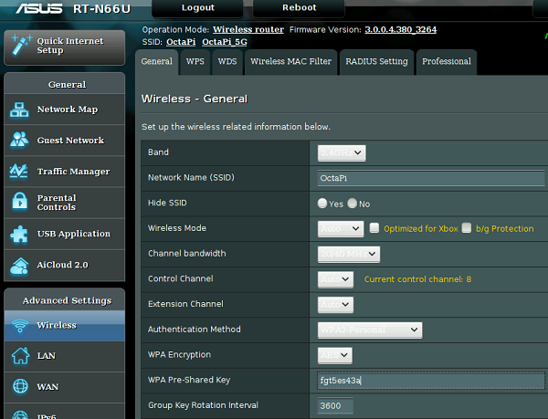
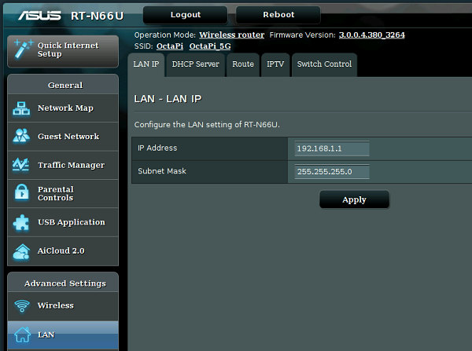
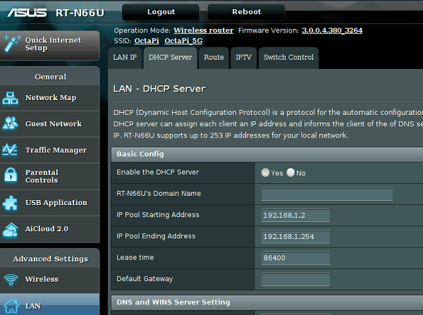

# Set up the wireless router

The processors in your OctaPi cluster will communicate over a dedicated local Wi-Fi network. The router does not need to be connected to the internet for operation of the cluster, nor does it need to be on-line for setup.

We will assume you are using a brand new router.

1. Power on your wireless router.

1. Connect a computer to the router using an ethernet cable. You can use any computer system that has a web browser, including a working Raspberry Pi 3.

1. Follow the instructions for setting up your router that came with the device. This normally involves opening a web browser and navigating to your router's 'admin' page to start changing the router settings. The 'admin' login credentials will have been provided by your Wi-Fi router manufacturer.

1. Look for a setting which allows you to set the Wi-Fi network name (also called SSID) and set it to "OctaPi". For example the page may look like this:

    

    **Note:** Raspberry Pi 3 computers only work with 2.4 GHz Wi-Fi, so you can either ignore 5GHz settings or disable 5GHz Wi-Fi in your router.

1. Now look for the LAN IP settings, which may be under the 'LAN' settings. Change the IP address of your router to `192.168.1.1` - again, each router's administrator interface will be different, but here is an example of what you might see:

    

    **Note:** You may need to reboot your router and log back in as 'admin' after this step.

1. Set the Wi-Fi network password, which may be under "Wireless Security" or similar

    **Important:** Make sure you write down the password so that you can use it to log onto your dedicated "OctaPi" network.

1. Look for the DHCP settings (DHCP is a protocol used for issuing IP addresses automatically, the client and servers will use this to determine their IP addresses). The settings for DHCP may be under 'LAN'. Make sure DHCP is enabled and set the DHCP address range to something that provides a useful range of addresses; we chose `192.168.1.2` to `192.168.1.254`, but this is not critical.

    

1. If there is a setting for the IP lease time, make this number as large as possible.

    The lease time is the length of time before DHCP reallocates IP addresses, so you need this to be large to avoid interrupting the connection between the client and servers.

1. Reboot your Wi-Fi router so that all the changes come into effect.
