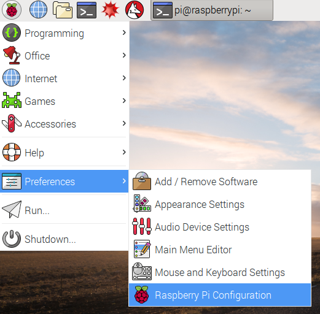
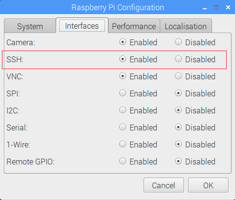

# Set up one OctaPi server

Each of the Raspberry Pi 3 computers in the cluster needs to have its own micro SD card prepared. However, as each card is identical, you can set up just one server and check it's working before replicating the SD card for the other servers.

- On a fresh SD card, install the latest version of Raspbian by following the [software guide instructions](https://www.raspberrypi.org/learning/software-guide/quickstart/){:target="_blank"}.

- Boot up a Raspberry Pi 3 using this SD card with a keyboard, screen, and mouse connected. Also ensure you are connected to the internet before proceeding.

- Open a terminal.

    

- As with the client, install the **dispy** software by typing this command into the terminal:

    ```
    sudo pip3 install dispy
    ```

- Install the **psutil** software by typing this command into the terminal:

    ```
    sudo pip3 install psutil
    ```

    **Dispy** uses psutil for reporting CPU usage of the servers in the cluster.


- If you are using the optional Pimoroni **Unicorn HATs**, install the software for them by typing this command into the terminal:

    ```
    curl https://get.pimoroni.com/unicornhat | bash
    ```

    You will need to restart your Pi after installing the Unicorn HAT software.
    
    Then, make sure you are in the `/home/pi` folder by typing `cd /home/pi`.
    
    Download the `start_unicorn.sh` bash script for installation on the server using this command:

    ```bash
    wget https://raw.githubusercontent.com/raspberrypilearning/octapi-setup/server/start_unicorn.sh
    ```
    
    Make this script executable by typing this command:
    
    ```bash
    chmod u+x ./start_unicorn.sh
    ```

- Go back to the terminal window and type the following command to begin editing the `/etc/rc.local` file:

    ```
    sudo nano /etc/rc.local
    ```

- Near the bottom of the file, just before `exit 0`, add the following lines to run the **dispy** server software as a daemon (a process running in the background) each time the server boots:

    ```bash
    sleep 20
    _IP=$(hostname -I)
    /usr/local/bin/dispynode.py -i "$_IP" --daemon
    ```

    **Note:** The sleep for 20 seconds is to allow time for the server to log onto your Wi-Fi router and obtain a network IP address from it. You need the IP address so that the server will listen properly for the client on the network. You may have to adjust this delay to suit the router you are using.

- Press `Ctrl` + `o` to save your changes, then `Ctrl` + `x` to exit the nano editor.

- Check that remote login via SSH is enabled so that remote command line access to your server is possible. Under the Preferences menu, select Raspberry Pi Configuration.

    

    Then click on the **Interfaces** tab and make sure that SSH is enabled.

    
