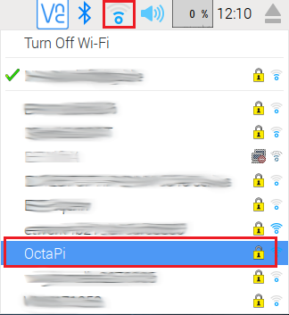
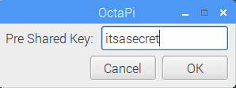

## Set up the server on the OctaPi network

Still using the **server** Raspberry Pi, we need to switch from the internet-connected network to the OctaPi network. Ensure your OctaPi Wi-fi router is powered up and fully booted.

- Click on the Wi-Fi symbol at the top of the desktop and select the "OctaPi" network

    

- Enter your router's network password (which you noted down earlier) to join the network.

    

    Having done this, the server will remember the Wi-Fi credentials and log onto your dedicated "OctaPi" network each time it boots.

- We need to remove any previous Wi-Fi information to avoid confusion.

    In a terminal window, type the following command to edit the `wpa_supplicant.conf` file:

    ```bash
    sudo nano /etc/wpa_supplicant/wpa_supplicant.conf
    ```

    The file contents look like this

    ```bash
    ctrl_interface=DIR=/var/run/wpa_supplicant GROUP=netdev
    update_config=1
    country=GB

    network={
	    ssid="OctaPi"
	    psk="mynetworkpassword"
	    key_mgmt=WPA-PSK
    }
    ```

    Remove any 'network { }' sections for other networks and press `Ctrl` + `o` to save and `Ctrl` + `x` to exit.

    **Important:** If alternative Wi-Fi networks are not removed, your server may log into the wrong network and not be available to the client.

- When finished, shut down the server Raspberry Pi.
