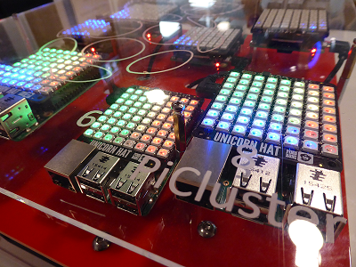

# OctaPi physical set up

1. Decide how you will power your OctaPi. You could simply power each of the eight Raspberry Pi computers separately using eight standard power supplies, or you may find it more convenient to use a USB hub or charger in order to power them centrally.

    **IMPORTANT:** It is essential that there is sufficient power to provide 2.4A to each Raspberry Pi 3 connected. Not all USB hubs/chargers can power 2.4A on every port, so you will need to check this carefully.

1. If you are using the optional Unicorn HATs, install a HAT onto the GPIO connector of each of the eight servers in the OctaPi cluster.

1. If you wish, you could mount the eight Raspberry Pi 3s onto a backboard. Alternatively there are cases for multiple Raspberry Pis available to purchase, or you can simply leave them laid out - they will still work as a cluster even if they aren't attached to anything!

    
